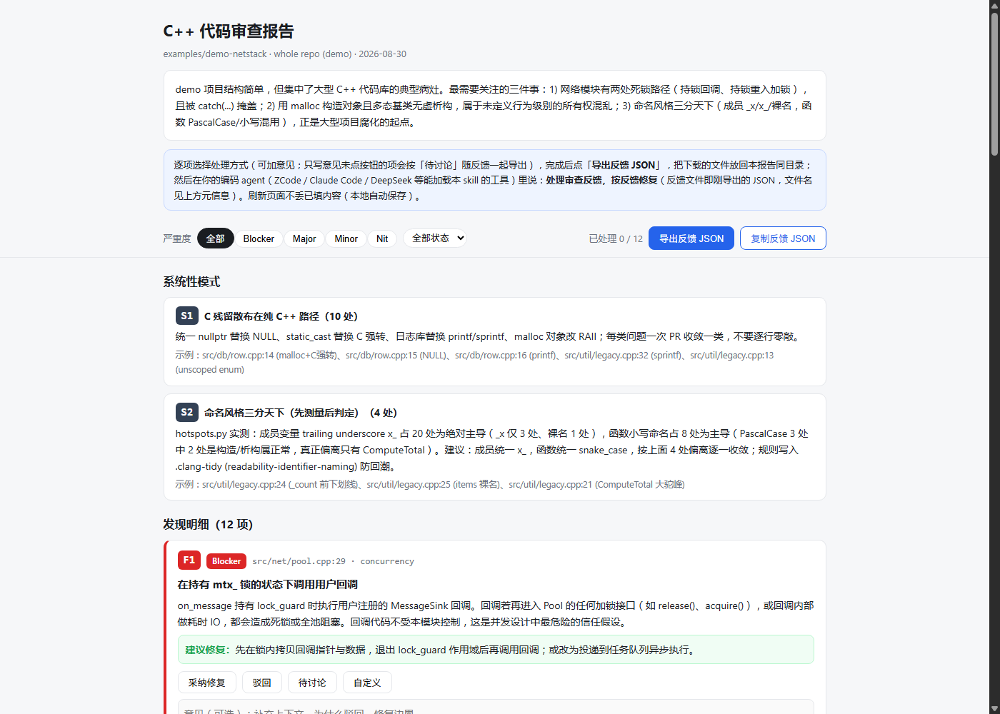
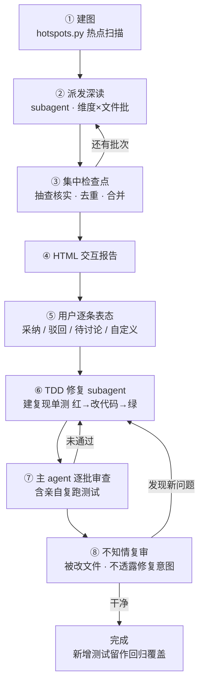

# cpp-review-loop

**大型 C++ 项目的审查—反馈—修复闭环 Skill。** 跨 agent 通用：ZCode / Claude Code / DeepSeek Harness 等均可使用。

> An agent skill in the open `SKILL.md` format for reviewing **large-scale C++** codebases, then driving the fix round from per-finding user feedback. Works with any agent that loads skills.

## 引言

大型 C++ 项目动辄百万行、多团队长期演进，代码审查在这里面临三重困境：人工读不过来；
通用扫描工具产出海量未核实的误报——而**误报比漏报更快摧毁信任**；审查报告写完即
"归档"，发现的问题有没有修、修得对不对，无人闭环。

cpp-review-loop 的目标，是把审查从"交付一份报告"变成"运行一个收敛过程"。它的设计
逻辑由四条主线构成：

1. **先测量，后判断** —— `hotspots.py` 先用客观数据建立全项目热点图，再按热点抽样
   深读；一致性条目先测量项目主导风格、只报少数派偏离，绝不把审查者的个人口味当标准。
2. **候选 ≠ 发现** —— 任何模式命中都必须打开上下文核实后才允许进报告；系统性模式
   （"34 处裸 `new` 分布在 9 个模块"）优先于逐行 nit。
3. **审查的产出是交互，不是文档** —— 报告是可交互 HTML，用户对每条发现表态
   （采纳 / 驳回 / 待讨论 / 自定义意见即决策），导出的反馈 JSON 直接驱动修复轮。
4. **修复不靠信任，靠闭环** —— 深读按"维度 × 文件批"派发给聚焦 subagent、主 agent
   逐批检查点；行为类修复走 TDD-LOOP（复现单测先红后绿）；修完由不知情的复审
   subagent 兜底，新问题回炉。三圈相扣，质量只朝一个方向收敛。

跨 agent 与完全离线是两条工程底线：任何能加载 `SKILL.md` 并运行 Python 脚本的工具
都能完整使用它；断网机器上报告依旧可渲染、可交互、可导出。所有设计都经过双盲实验
校准——查准 8/8、误报 0 的完整实测见 [docs/VALIDATION.md](docs/VALIDATION.md)。



## 为什么叫 loop

整个 skill 是一圈套一圈的质量收敛环：



- **①–④ 深读环**：每批 subagent 返回即过检查点（抽查 → 去重 → 合并），未核实不进报告；
- **⑤–⑦ 反馈-修复环（TDD）**：你的表态驱动修复，行为类修复必须先红后绿；
- **⑧ 复审环**：修完不算完——不知情的眼睛复核过被改文件，新问题回炉再修。

## 特性一览

| 特性 | 说明 |
|---|---|
| 先建图，后审查 | `hotspots.py`（纯标准库）产出热点图：文件/函数排名、include 扇出、TODO 密度、git churn、红旗候选、命名分布、日志键值风格、构建加固旗标 |
| 一致性审计 | 先测量主导风格、再抓少数派偏离：C/C++ 混用与头文件/命名/typedef/初始化（A–E 组）、公开规范吸收（Core Guidelines / Google / CERT，F–I 组）、日志与输出格式统一（L 组） |
| 系统性模式优先 | 报告"34 处裸 `new` 分布在 9 个模块"这类模式，不堆逐行 nit；反噪音清单压住误报 |
| 交互式 HTML 报告 | 逐条 采纳 / 驳回 / 待讨论 / 自定义（自定义意见即决策）；点击编号复制；localStorage 自动保存；导出反馈 JSON |
| 编排式执行 | 主 agent 负责建图、派发、检查点与汇总；宿主无 subagent 能力时自动退化为顺序自执行 |
| 弱模型加固 | 执行门 G1-G8 / F1-F6（每道门有必须实际存在的产出物）+ 报告前逐项自检 + 渲染器硬校验：缺覆盖声明、缺修复建议的 findings 直接拒绝渲染并给出中文报错 |
| 完全离线 | 脚本只用 Python 标准库；HTML 零外部依赖，`file://` 双击即用 |

## 交互报告与修复轮

1. 审查产出 `code-review-findings.json` + `code-review-report.html`；
2. 浏览器逐条表态（可加意见）→ 点「导出反馈 JSON」（localStorage 自动保存，刷新不丢）；
3. 对 agent 说 **"处理审查反馈"**，进入修复轮。

| 表态 | 修复轮行为 |
|---|---|
| 采纳修复 | 按建议修（结合你的意见）：先建复现单测 红 → 改代码 → 绿 |
| 驳回 | 跳过，记录你的理由 |
| 待讨论 | 只回应，不改代码 |
| 自定义 | 你的意见就是方案，按它执行（同样走 TDD-LOOP） |

修复纪律：行为类修复测试先行，测试永久留作回归覆盖（"红不了"的测试 = 没覆盖场景，先改测试）；主 agent 逐批审查，含亲自复跑测试、**hotspots 复扫被改文件并对比修复前基线**（新引入的魔数/裸 new/新时间源当场抓住）；全部修完后由**不知情的新 subagent** 复审被改文件，引入的新问题回炉再修；项目无测试设施时先征求你的意见，不擅自引入第三方框架。

## 安装

把 [`cpp-review-loop/`](cpp-review-loop/) 复制到所用 agent 的技能目录：

| Agent | 技能目录 |
|---|---|
| ZCode | `~/.agents/skills/`（用户级）；`<project>/.zcode/skills/` 或 `<project>/.agents/skills/`（项目级） |
| Claude Code | `~/.claude/skills/`（用户级）；`<project>/.claude/skills/`（项目级） |
| DeepSeek Harness 等 | 按其文档配置的技能/SKILL.md 目录 |

skill 本体不依赖任何宿主私有 API——只有 Markdown 指令、纯标准库 Python 脚本、自包含 HTML。宿主只要能：① 加载 `SKILL.md` 并按需读取 `references/`；② 运行 `python scripts/…`，即可完整使用。若所用工具不支持技能机制，也可以直接把 `SKILL.md` 的内容粘进系统提示 / 项目指令里使用。

```bash
# macOS / Linux
cp -r cpp-review-loop ~/.agents/skills/

# Windows (PowerShell)
Copy-Item -Recurse cpp-review-loop "$env:USERPROFILE\.agents\skills\"
```

## 使用

对 agent 说：

- "帮我审查代码" / "检查这个 C++ 项目的质量" / "review this repo"
- 可指定范围：整个仓库 / 某个模块 / 某次 PR diff / 单个文件

产出：**聊天摘要**（总体评估 + 发现汇总表 + 覆盖度声明）和**交互报告**（findings JSON + HTML）。

## 示例

[`examples/demo-netstack/`](examples/demo-netstack/) 是一个刻意埋了典型问题的假项目（网络缓冲池），带 12 条发现 + 2 条系统性模式，以及生成好的 [`code-review-report.html`](examples/demo-netstack/code-review-report.html)——直接用浏览器打开就能体验交互报告。

自测热点扫描：

```bash
python cpp-review-loop/scripts/hotspots.py examples/demo-netstack --top 15
```

## 目录结构

```
cpp-review-loop/            # 技能本体（安装时复制这个目录，Agent Skills 规范结构）
├── SKILL.md                # 主流程：分诊 → 建图 → 派发审查 → 报告 → TDD 修复闭环
├── references/             # 按需加载：checklist / consistency / standards / report-format / tooling
└── scripts/                # hotspots.py（热点扫描）· make_report.py（渲染交互报告）
examples/demo-netstack/     # 演示项目 + 12 条发现 + 可打开的交互报告
docs/                       # 验证记录 VALIDATION.md + 报告截图
eval/                       # 有效性实验原始产物（双盲实现项目 + 5 轮迭代 + 实验报告）
```

## 设计原则

- **误报比漏报更毁信任** — 任何发现必须打开上下文核实；grep 命中只是候选，不是发现。
- **项目规范 > 一切外部规范** — 项目自带 `.clang-format` / `.clang-tidy` / 命名文档时以项目为准，审查者不输出个人口味。
- **覆盖率必须诚实** — 凡超过单文件规模的审查，必须声明审查了什么、没审查什么。
- **离线是硬约束** — 脚本与生成物永不依赖网络（无 CDN、无 pip 依赖）。

验证方法与全部实测记录——端到端双盲有效性测试（查准 8/8、误报 0）、扫描器信号正反例夹具、迭代漂移实验——见 [docs/VALIDATION.md](docs/VALIDATION.md)。

## 环境要求

- Python 3.8+（仅标准库，无需 pip 安装任何东西）
- 任意现代浏览器（打开 HTML 报告）
- 可选：clang-tidy / cppcheck（已装才用；skill 绝不往你的项目里安装任何工具）

## License

[MIT](LICENSE)
